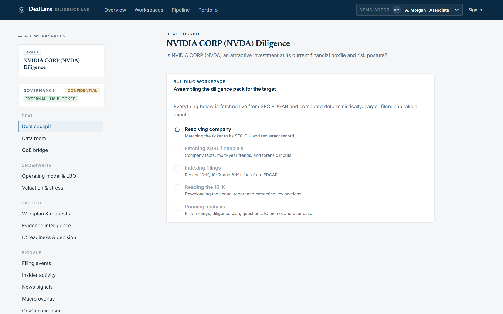
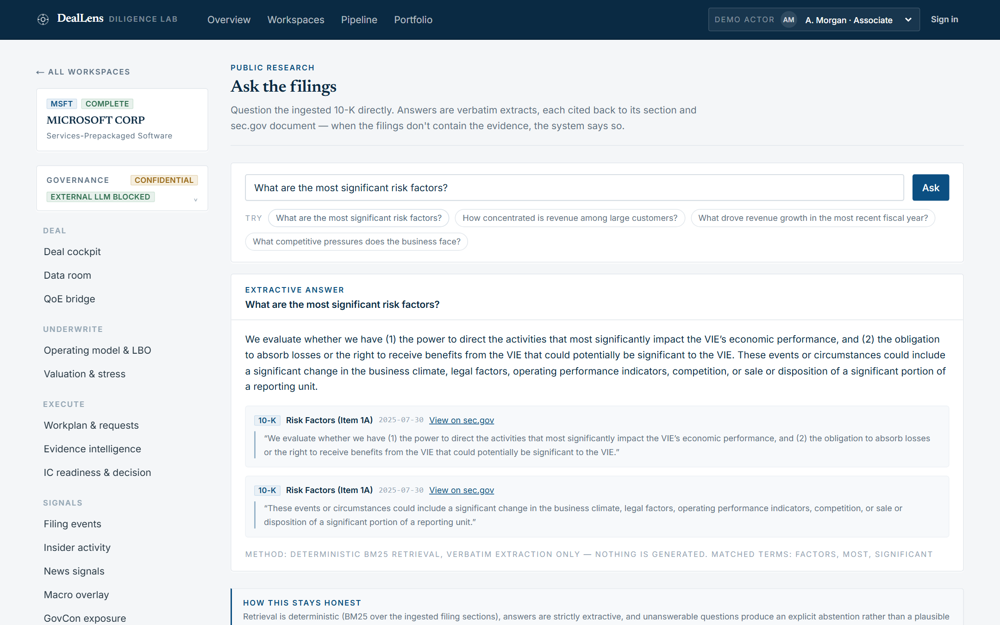
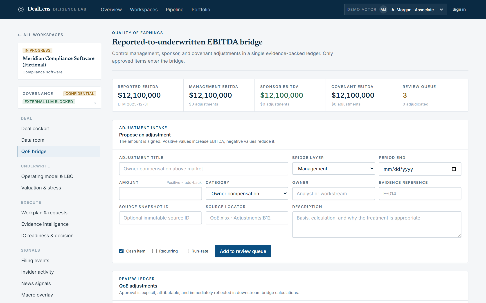
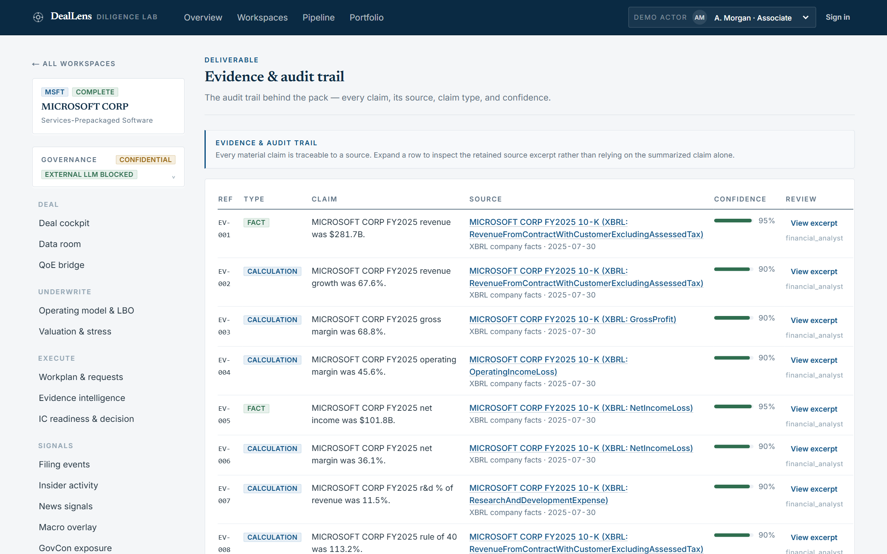
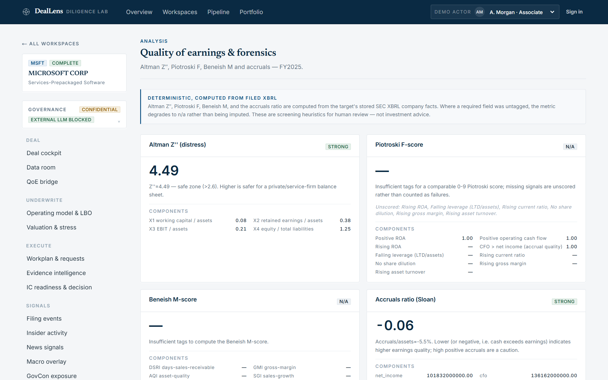
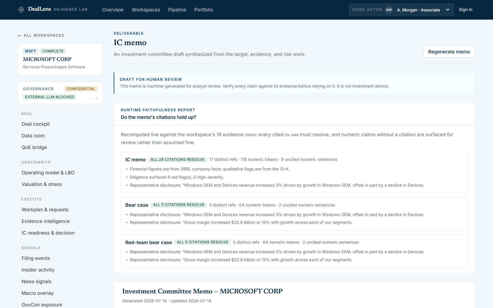
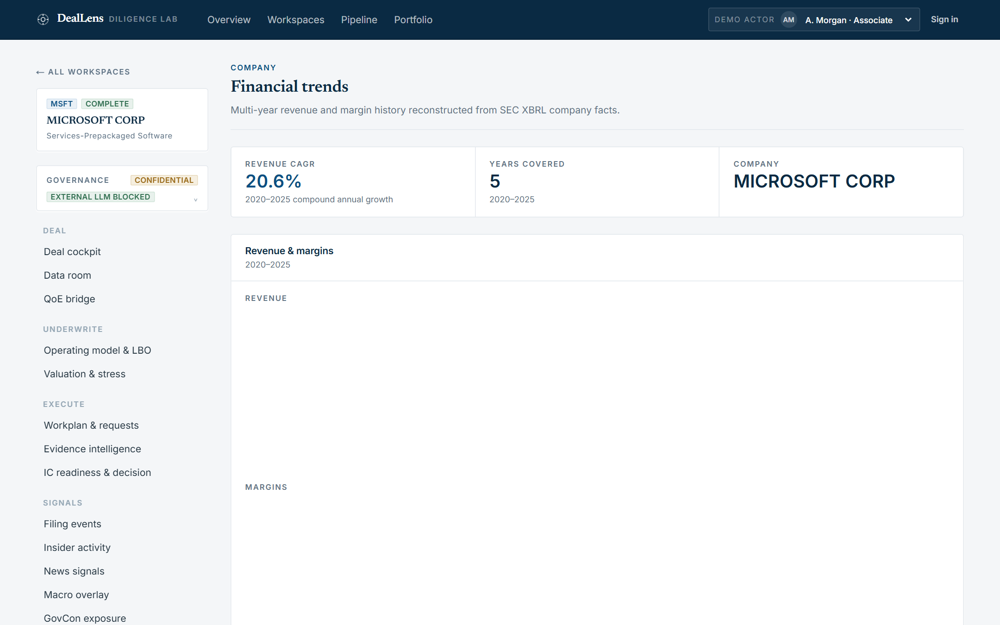

# DealLens Diligence Lab

[](https://github.com/ahines99/deallens-diligence-lab/actions/workflows/ci.yml)
[](LICENSE)


**A private-equity underwriting and diligence workbench with deterministic models, governed evidence,
deal execution, and investment-committee controls.**

Type a ticker and watch a diligence workspace build itself live from SEC EDGAR:



DealLens Diligence Lab is an independent, non-commercial portfolio project demonstrating an end-to-end
investment workflow for private and public targets. Teams can import management financials and deal-room
documents, build versioned cases, run an institutional LBO/debt/covenant model, execute diligence, review
cited claims, and freeze the exact evidence/model snapshot presented to investment committee. Public
targets can additionally ingest live SEC EDGAR filings and XBRL facts
— while keeping **every material claim source-grounded, traceable, and reviewable by a human**.

> The point is not to automate investment judgment. The point is to show how AI can accelerate the
> evidence-gathering, issue-spotting, memo-drafting, and red-team process while keeping humans
> accountable for decisions.

---

## What this demonstrates

| Capability | Where to see it |
|---|---|
| **Measured, grounded AI** — hybrid retrieval (deterministic keyless embeddings fused with BM25 via reciprocal-rank fusion) gated by a CI eval harness (recall@k / MRR floors); extractive cited Q&A with explicit abstention; optional live-LLM grounded synthesis that fails closed on any citation/number drift; LLM-as-judge faithfulness evals; hashed prompt manifests bound to every LLM-touched run | "Ask the filings" tab · [`filings_qa_service.py`](apps/api/src/services/filings_qa_service.py) · [`retrieval_service.py`](apps/api/src/services/retrieval_service.py) · [`src/eval/`](apps/api/src/eval/) |
| **Evidence governance** — append-only evidence with monotonic `EV-###` refs enforced at the ORM layer, plus a runtime faithfulness report that re-verifies every memo citation on demand | Evidence tab · memo faithfulness panel · [`evidence.py`](apps/api/src/models/evidence.py) |
| **Governed agentic depth** — a consent-gated diligence agent over read-only governed tools whose final answer passes a fail-closed grounding gate (any number or `EV-###` ref no tool produced rejects the answer; the gate audits a curated evidence projection of each tool result, so argument echoes cannot launder fabricated figures); agent-drafted memo sections under human accept/reject; comparative multi-workspace runs with unanimous consent and tenant-scoped comps; idempotent streamed runs sealing append-only transcripts | Agent tab · [`agent_service.py`](apps/api/src/services/agent_service.py) · [`agent_tools.py`](apps/api/src/services/agent_tools.py) |
| **Deterministic financial engineering** — XBRL-derived forensics (Altman Z″, Piotroski F, Beneish M), WACC/DCF, multi-tranche LBO with covenants, Monte Carlo returns bands, returns attribution, covenant-headroom projection, a safe driver-formula model (AST-whitelisted, cycle-detected), and fund-level portfolio construction — no imputation: missing data degrades to "n/a", never a guess | Forensics / Valuation / Underwriting / Stress tabs · [`underwriting_model_service.py`](apps/api/src/services/underwriting_model_service.py) |
| **Public-data research depth** — live SEC EDGAR: XBRL financials + quarterly/TTM + segment revenue, 10-K risk-factor cross-year diff, DEF 14A proxy comp & governance flags, 13F ownership concentration, 13D/13G activist detection, debt maturity walls, insider-pattern analytics — all keyless, all honest about availability | Signals & research tabs · [`sec_financials.py`](apps/api/src/services/sec_financials.py) · [`ownership_service.py`](apps/api/src/services/ownership_service.py) |
| **Institutional governance & collaboration** — multi-tenant auth with org-scoped 404s, four-eyes QoE/IC approvals, content-hash-frozen IC packets, HMAC-signed webhook outbox, scoped API keys, fine-grained capability grants, optional OIDC SSO, comment threads with @mentions, a cross-plane review inbox, and revocable read-only share links | IC readiness tab · [`deal_workflow_service.py`](apps/api/src/services/deal_workflow_service.py) |
| **Operable platform** — Alembic migrations, hash-pinned lockfile, CI on both SQLite **and** a Postgres service matrix (lint, migration drift check, ~820 backend + ~70 frontend tests, retrieval-eval gate, perf-budget smoke, compose smoke), Prometheus `/metrics` + structured logs + request-ID tracing, durable job queue, full-text search, blob-storage abstraction, per-org quotas | [`.github/workflows/ci.yml`](.github/workflows/ci.yml) · [`docs/ROADMAP-WAVE4.md`](docs/ROADMAP-WAVE4.md) · [`docs/deploy-demo.md`](docs/deploy-demo.md) |
| **Red-team hardened** — four adversarial audit waves (2026-07-15 → 07-18) probed tenant isolation, grounding laundering, four-eyes bypasses, and quant knife-edges; every HIGH/MEDIUM/LOW finding was remediated with a regression test | [`docs/HANDOFF.md`](docs/HANDOFF.md) §6 · `git log` |

| | |
|---|---|
|  *Cited, abstaining Q&A over the real 10-K* |  *QoE bridge: proposed add-backs awaiting four-eyes approval* |
|  *Every material claim resolves to an evidence row* |  *Deterministic forensics computed from XBRL facts* |
|  *IC memo with a live citation-faithfulness report* |  *Multi-year trends extracted from company facts* |

---

## ⚠️ Disclaimer

DealLens Diligence Lab is an independent, non-commercial portfolio project using public data (primarily
SEC EDGAR). It is not affiliated with, endorsed by, or sponsored by any investment firm, private equity
firm, public company, data vendor, or AI platform vendor. Outputs are AI-assisted, deterministic drafts
for educational and demonstration purposes only, are **not investment advice**, and should not be used to
make investment decisions. Qualitative risk severities are heuristic and require human validation;
market and transaction data must be supplied by the analyst or a licensed source.

---

## The demo in one minute

Search any public company by **name or ticker** (e.g. **MSFT**, **NVDA**, **CRWD**) and get a **real,
SEC-grounded diligence pack**. The backend resolves the company against SEC EDGAR, pulls XBRL company
facts, lists recent 10-K / 10-Q / 8-K filings, fetches the latest 10-K and extracts its risk factors,
then deterministically builds the whole pack — with live step-by-step progress while it works. Prefer
the private-deal story? One click loads a clearly-labeled **fictional example deal** (management
financials, data room, proposed QoE adjustments) through the same governed import pipeline, leaving the
approvals, underwriting, and IC assembly for you to drive:

> **Example — CRWD (CrowdStrike):** ~$4.8B revenue, ~22% growth, ~75% gross margin, a **negative GAAP
> operating margin**, and a Rule-of-40 around 16% — benchmarked against real peers (PANW, ZS, S). Red
> flags come from the real 10-K (legal/regulatory, AI-disruption, integration/M&A) plus deterministic
> financial flags (GAAP operating loss, net loss).

The app produces a full first-pass **diligence pack**: target overview (real XBRL), real public comps and
a fundamentals benchmark, diligence plan, red-flag matrix, questions by workstream, a draft IC memo, a
bear-case memo, and an inspectable **evidence table** where every claim traces to an XBRL concept or a
10-K passage on `sec.gov`.

Market **valuation multiples are omitted** (no free source), and qualitative severities are keyword-based
heuristics that require human validation. Creating a workspace with a ticker requires **network access**
to SEC EDGAR and a descriptive `SEC_USER_AGENT`.

---

## Quickstart

### Option A — Docker (production-shaped: Postgres + pgvector)

```bash
cp .env.example .env
docker compose up --build
# web  → http://localhost:3000
# api  → http://localhost:8000  (docs at /docs)
```

### Option B — Local (no Docker; SQLite, zero external services)

The backend defaults to SQLite (a local file) and requires no database server and no LLM key. Seeding
real demo workspaces requires **network access** to SEC EDGAR and a descriptive `SEC_USER_AGENT`.

**Backend (Python 3.11+):**

```bash
cd apps/api
python -m venv .venv
# Windows PowerShell: .venv\Scripts\Activate.ps1
# macOS/Linux:        source .venv/bin/activate
pip install -e ".[dev]"
python -m alembic -c alembic.ini upgrade head
export SEC_USER_AGENT="DealLens Diligence Lab (portfolio) you@example.com"   # SEC fair-access
uvicorn src.main:app --reload         # http://localhost:8000
```

On Windows PowerShell, set the SEC identity with `$env:SEC_USER_AGENT="DealLens Diligence Lab
(portfolio) you@example.com"`. Local startup applies Alembic migrations automatically by default;
running `python -m alembic -c alembic.ini upgrade head` explicitly is still recommended before a demo
or deployment.

No seeding is required. After registering the first owner, create workspaces directly from the UI:
search any public company by name or ticker (the workspace builds itself live from SEC EDGAR with
step-by-step progress), or click **Load the example private deal** to walk the full private
underwriting workflow on clearly labeled fictional data — imported through the same governed
pipeline, with QoE approvals, underwriting, and IC assembly left for you to drive.

(`python -m src.seed.load_seed` remains available as a dev utility that pre-ingests MSFT and CRWD;
when multiple organizations exist, set `SEED_ORGANIZATION_SLUG` first. It is a no-op if workspaces
already exist.)

**Frontend (Node 20.19+):**

```bash
cd apps/web
npm install
npm run dev                           # http://localhost:3000
```

Set `NEXT_PUBLIC_API_URL=http://localhost:8000` in `apps/web/.env.local` if your API is elsewhere.

If PowerShell reports that `npm.ps1` cannot run because script execution is disabled, call npm's
Windows executable directly; this does not require changing the machine execution policy:

```powershell
cd "D:\Code\Personal\Portfolio Projects\deallens-diligence-lab\apps\web"
npm.cmd install
$env:NEXT_PUBLIC_API_URL="http://localhost:8000"
npm.cmd run dev
```

Open `http://localhost:3000/register` to create the first user and organization, or
`http://localhost:3000/login` to resume an existing session. The same-origin web bridge keeps the
opaque session token in an HttpOnly, SameSite=Strict cookie; browser storage contains only non-secret
identity metadata. The app supports verified organization switching and logout. Authentication is
required by default. Only set
`AUTH_REQUIRED=false` for an explicitly isolated local demo; that mode trusts development actor
headers and must never be exposed to another network.

The first registered user bootstraps the installation even when `AUTH_ALLOW_REGISTRATION=false`.
Keep that secure default after bootstrap; temporarily opt in only when deliberately onboarding
additional self-registering users. Docker binds the web/API ports to localhost and does not publish
Postgres. A real external deployment still requires TLS and a trusted reverse proxy.

### Makefile shortcuts

```bash
make install   # install api + web deps
make seed      # (dev utility) pre-ingest MSFT/CRWD from live SEC — the UI needs no seeding
make dev       # run api + web together (GNU make launches both jobs)
make test      # run backend pytest and frontend Vitest suites
make up        # docker compose up --build
make down      # docker compose down
```

### Hosting a public demo

The repo ships a hardened demo posture — one-click guest sessions, per-IP throttling of SEC-bound
builds, an EDGAR response cache, and a retention-cleanup worker — so a public instance is a
configuration decision, not a project. See [`docs/deploy-demo.md`](docs/deploy-demo.md).

---

## The diligence workflow

```
Ticker ─▶ SEC EDGAR ingest (XBRL + latest 10-K) ─▶ Target + risk-factor chunks
    │                                                        │
    ├─ Financial benchmark ◀── Public comps (real peers by ticker) ◀──┤
    ├─ Risk / red-flag matrix ◀──────────────────────────────┤
    ├─ Diligence questions (by workstream) ◀─────────────────┤
    ├─ IC memo draft ◀───────────────────────────────────────┤
    ├─ Bear-case / red-team memo ◀───────────────────────────┤
    └─ Evidence & audit table (every material claim) ◀────────┘
```

Creating a workspace with a ticker runs the whole pipeline in one pass. Every generated artifact links
back to **Evidence** rows that record the claim, its type (`fact` / `calculation` / `inference` /
`assumption`), the SEC source (XBRL concept or 10-K passage with its `sec.gov` URL), and confidence. See
[`docs/evidence-model.md`](docs/evidence-model.md).

### Roadmap extensions (live)

Three keyless, real-data features now sit on top of the SEC core flow — **no API key required for either
USAspending or FRED**. Full details in [`docs/govcon-and-macro.md`](docs/govcon-and-macro.md).

- **Multi-year XBRL trends** (`GET /trends`) — revenue + gross/operating/net margin and R&D % for the last
  five fiscal years plus a computed **revenue CAGR**, from the same SEC company facts; the CAGR is cited as
  a `calculation` and shown as an IC-memo row.
- **FRED macro overlay** (`GET /macro`, **keyless**) — a sector-aware macro backdrop (policy rate, 10-yr
  yield, inflation, unemployment, industrial production, GDP) mapped from the target's SEC sector, with
  latest value + YoY. Context, not a forecast.
- **GovCon federal-contract diligence** (`GET`/`POST /govcon`, **keyless**, via USAspending.gov) —
  **agency concentration** (top agency's share of obligations), **recompete** exposure (top awards with a
  period of performance ending within ~24 months), top awards, and an incumbent view. `POST` re-runs the
  analysis so real `govcon_risk` findings and a memo GovCon section fold in. This makes DealLens suit
  **defense / GovCon diligence** — e.g. Leidos shows ~$128B in federal obligations with DoD at ~52%
  concentration.

### Financial DD, valuation & signals (Wave 2, live)

Closing the two workstreams that dominate real deal effort — quality-of-earnings and returns — plus SEC
event/signal feeds and automations. All keyless.

- **Quality of Earnings & financial forensics** (`GET /forensics`) — from XBRL: **Altman Z″**, **Piotroski
  F-score**, **Beneish M-score**, Sloan **accruals**, plus net working capital, DSO/DIO/DPO / cash-conversion
  cycle, FCF, cash conversion, interest coverage, net debt and net-debt/EBITDA. Breaches feed the red-flag
  matrix (e.g. Z″ < 1.1 → distress). Degrades to `n/a` (never imputes) when a concept is untagged.
- **Valuation & returns** (`GET /valuation`, `POST /lbo`) — WACC anchored on FRED, a DCF-lite, and an
  interactive **LBO engine** returning IRR/MOIC with an entry × exit multiple **sensitivity grid**. Every
  assumption is labeled; no fabricated market data.
- **SEC event & signal feeds** (keyless) — an 8-K **material-event timeline** (Item 4.02 non-reliance flagged
  critical), **Form 4 insider** activity, a full-text **red-flag theme scan** (going-concern, material weakness,
  restatement…), and **GDELT news** (labeled unverified media, kept out of the evidence table).
- **Automations** — **filing-watch** (new filings since last analysis) with one-click **refresh** (re-ingest +
  re-analyze), and **SIC-based auto-peer** discovery for the comp set.

### Institutional underwriting workbench (Wave 3A/3B)

Wave 3 turns the research dashboard into a controlled PE deal system. The implementation and example
contracts are documented in [`docs/WAVE3.md`](docs/WAVE3.md).

- **Private-company data foundation** — no ticker required; immutable source snapshots; guarded CSV and
  XLSX imports; account mapping, period/unit/currency provenance, reconciliation, and exception review.
- **QoE adjustment ledger** — reported to management, sponsor, and covenant EBITDA, with evidence and
  approval required before an adjustment enters the underwritten bridge.
- **Versioned operating/LBO model** — monthly Y1–Y2 and annual Y3–Y5 cases, integrated cash/debt schedules,
  SOFR/floors/spreads, PIK, revolver, cash sweep, covenants, XIRR/MOIC, FCFF DCF, working-capital peg,
  valuation triangulation, sensitivities, and reverse stress.
- **Deal execution and IC governance** — organization/fund/deal scope, stage gates, team/workstreams/tasks,
  diligence requests, decision ledger, frozen IC packets, comments, four-eyes decisions, conditions to
  close, diffs, audit events, and hashed PDF/DOCX/XLSX/JSON exports.
- **Document intelligence** — immutable PDF/DOCX/XLSX/CSV/TXT versions, exact page/sheet/cell citations,
  abstaining Q&A, schema extraction, human claim approval, contradiction/change detection, SEC filing
  diffs, and persisted evaluation metrics.
- **Enterprise controls** — tenant-aware workspace isolation, password authentication with revocable
  server-side sessions and organization roles, non-destructive analysis/artifact versions, stable
  `/api/v1` contracts, encrypted signed-webhook delivery with retry/dead-letter handling, and Alembic
  migrations for fresh and legacy databases.

### Portfolio command center and governed IC controls (live)

- **Portfolio command center** (`/portfolio`) — headline KPIs, pipeline funnel, stage/fund/search filters,
  sector and strategy exposure, IC calendar, stage aging, readiness decomposition, workload, diligence
  SLA, conditions to close, return snapshots, downside/covenant watchlists, source health, and CSV export.
- **Governed identity and tenancy** — registration/login/logout, expiring opaque sessions hashed at rest,
  verified organization switching, owner/admin/member/viewer roles, tenant-scoped workspaces and document
  downloads, and spoof-resistant actor attribution.
- **Evidence-to-IC chain of custody** — approved document claims promote to immutable governed evidence;
  server-assembled IC packets bind exact model, claim, document, chunk, and export-manifest hashes, with a
  verification endpoint for detecting later tampering.
- **Operational oversight** — a unified activity timeline, webhook delivery-health metrics and traceable
  dead-letter replay, system/source health, financial-import dry runs, and explainable reconciliation,
  mapping, exception, freshness, and fiscal-period diagnostics.
- **Data-governance policy** — each workspace has a classification and explicit external-LLM consent.
  Restricted workspaces cannot enable external processing; deterministic local generation remains the
  default for every classification.

### Agentic diligence, model ops, and audit hardening (Waves 5–6, live)

- **Governed diligence agent** (G57–G63) — objective in, cited answer out: a budget-capped tool loop
  over read-only governed tools (filing search, cited Q&A, risks, evidence, in-memory underwriting
  scenarios). Every run seals an append-only transcript; the final answer is **rejected outright** if
  it contains any number or `EV-###` reference no tool produced — the grounding gate audits a curated
  evidence projection of each tool result, so argument echoes cannot launder fabricated figures. Live
  SSE streaming with idempotent recovery (`client_request_id`: one click can never run, bill, or seal
  twice), agent-drafted memo sections under human accept/reject, and comparative runs across
  workspaces with unanimous consent and tenant-scoped comps.
- **Agent proposals under four-eyes** (G60) — the agent may *propose* QoE adjustments and structured
  claims as the distinguishable identity `agent:diligence`; the proposer≠decider rules and the
  human-reviewer requirements make automation approval provably impossible.
- **Model ops, measured** (G56/G79/G80/G81) — a `/quality` dashboard (judge-eval faithfulness,
  retrieval metrics, calibration, hashed prompt manifests), prompt A/B over a committed golden set
  behind an explicit operator opt-in (`GOLDEN_EVAL_LLM_ALLOWED`), and per-org LLM spend telemetry.
- **Redaction, attestation, and share analytics** (G74–G76) — four-eyes span redactions minting
  immutable redacted versions that every read surface inherits automatically; optional
  Ed25519-signed export attestation; watermarked share links with view analytics.
- **Quant depth** (G64–G73) — peer percentile benchmarking, sum-of-the-parts with an explicit
  never-force-balanced residual, buyback/dilution analysis, Item 3 litigation extraction,
  sensitivity tornado, dividend-recap solver, facility sizing, fund-level Monte Carlo with a shown
  (not asserted) correlation effect, and a Decimal-exact annual value-creation waterfall.
- **Adversarially audited** — four audit waves (2026-07-15 → 07-18) probed tenant isolation,
  grounding laundering, four-eyes bypasses, and quant knife-edges; every finding was remediated
  with a regression test (see [`docs/HANDOFF.md`](docs/HANDOFF.md) §6).

## Architecture

| Layer            | Choice                                                              |
|------------------|---------------------------------------------------------------------|
| Frontend         | Next.js (App Router), TypeScript, Tailwind CSS, Recharts            |
| Backend          | FastAPI, Python 3.11+                                                |
| ORM / DB         | SQLAlchemy 2.0 — SQLite by default, PostgreSQL + pgvector in Docker  |
| Data source      | **SEC EDGAR** — ticker→CIK, submissions, companyfacts (XBRL), 10-K docs |
| Retrieval        | Deterministic keyword/TF over 10-K section chunks (pgvector-ready)   |
| LLM layer        | Deterministic engine by default; optional live LLM only re-voices prose |
| Tests            | pytest — incl. a "no uncited material claims" check on a real SEC workspace |

Details: [`docs/architecture.md`](docs/architecture.md) ·
[`docs/data-sources.md`](docs/data-sources.md) ·
[`docs/diligence-methodology.md`](docs/diligence-methodology.md) ·
[`docs/govcon-and-macro.md`](docs/govcon-and-macro.md) ·
[`docs/sec-ingestion.md`](docs/sec-ingestion.md) ·
[`docs/evidence-model.md`](docs/evidence-model.md) ·
[`docs/example-case-study.md`](docs/example-case-study.md) ·
[`docs/demo-script.md`](docs/demo-script.md) ·
[`docs/deploy-demo.md`](docs/deploy-demo.md) ·
[`docs/disclaimers.md`](docs/disclaimers.md)

## Public data sources

| Source                              | Use                                                       | Status |
|-------------------------------------|-----------------------------------------------------------|--------|
| SEC EDGAR APIs                      | Ticker→CIK, submissions (10-K/10-Q/8-K), company facts (XBRL + multi-year trends), 10-K documents | **Primary (live)** |
| FRED                                | Sector-aware macro overlay (rates, inflation, unemployment, industrial production, GDP) | **Live (no key)** |
| USAspending.gov                     | GovCon: federal contract awards → agency concentration + recompete | **Live (no key)** |
| SEC Financial Statement Data Sets   | Standardized financial statement data                     | Extension |
| OpenFIGI                            | Security identifier mapping                                | Extension |
| GDELT                               | News signals (`GET /news`) — unverified media, kept off the evidence table | **Live (no key)** |
| SAM.gov                             | Federal opportunity / entity context (extends GovCon)     | Extension |

The core flow runs on **SEC EDGAR** (no key; a descriptive `SEC_USER_AGENT` is required). **FRED** and
**USAspending** are live and **need no key** (as is **GDELT** news, labeled unverified media); OpenFIGI
and SAM.gov remain wired extension points.
Market **valuation multiples are omitted** — no free source. See
[`docs/data-sources.md`](docs/data-sources.md) and [`docs/govcon-and-macro.md`](docs/govcon-and-macro.md).

## Design principles

1. Every material claim is tied to real evidence — an XBRL concept or a 10-K passage — where possible.
2. Facts, calculations, inferences, and assumptions are labeled distinctly.
3. Outputs are never presented as investment advice.
4. Citations are never fabricated — every `EV-###` cited must resolve.
5. Missing financials are omitted, not invented; valuation multiples require analyst/licensed inputs.
6. Filing-language signals are not treated as proof of realized exposure; human review remains required.
7. LLMs may draft/re-voice narrative, but calculations are deterministic and auditable.
8. Approved IC artifacts, model cases, sources, and claims retain immutable hashes and versions.

## Repository layout

```
apps/web    Next.js frontend (pages, components, api client)
apps/api    FastAPI backend (models, schemas, routers, services, agents, seed data)
docs        Architecture, methodology, evidence model, data sources, demo script
```

## License

MIT — see [`LICENSE`](LICENSE). Public data remains subject to the terms of its original providers.
